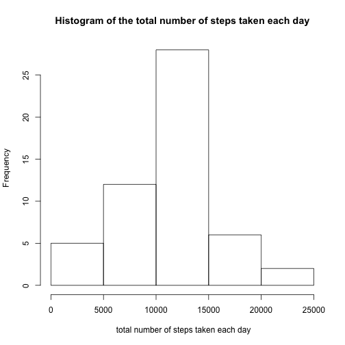
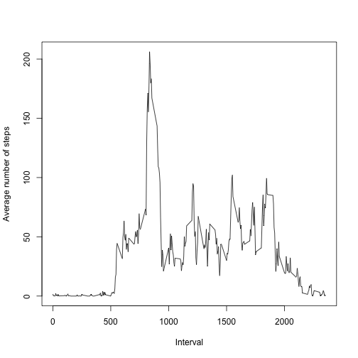
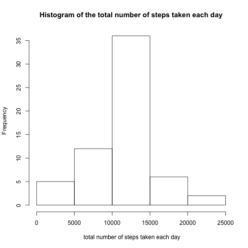
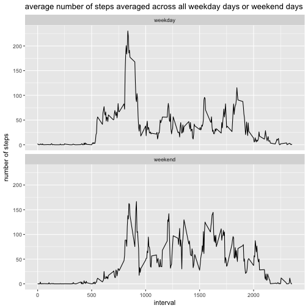

Course project 1: summary of activity
==========================================


```r
library(knitr)
opts_chunk$set(cache = TRUE, echo = TRUE)
fig.path='figure/'
```


# Load and preprocess the activity data 


```r
data <- read.csv("activity.csv")
data <- na.omit(data)
```

# mean total number of steps taken per day

```r
sumsteps <- with(data, tapply(steps,date, sum, na.rm=TRUE))
```
Here is the histogram plot of the total number of steps taken each day


```r
hist(sumsteps, main = "Histogram of the total number of steps taken each day", xlab = " total number of steps taken each day")
```




```r
stepsmean <- mean(sumsteps, na.rm = TRUE)
stepsmedian <- median(sumsteps, na.rm = TRUE)
```
The mean number of steps taken each day is 1.0766189 &times; 10<sup>4</sup>, The median number is 10765

# average daily activity pattern
Here is the time series plot  of the 5-minute interval and the average number of steps taken, averaged across all days 

```r
intervalsteps <- with(data, tapply(steps, interval, mean, na.rm=TRUE))
maxinterval <- names(intervalsteps[which.max(intervalsteps)])
maxsteps <- max(intervalsteps)
plot(names(intervalsteps), intervalsteps, type = "l", xlab= "Interval", ylab = "Average number of steps")
```



Interval 835 contains the maximum number of steps 206.1698113

# Imputing missing values

Calculate and report the total number of missing values in the dataset


```r
#reload the data and call it new data  
 newdata <- read.csv("activity.csv")
 narows <- sum(is.na(data))
```
There are totally 0 in the dataset.

Filling in all of the missing values in the dataset using the mean for that 5-minute interval

```r
for(i in 1:nrow(newdata)){
        if (is.na(newdata$steps[i])){
                newdata$steps[i] <- mean(subset(newdata, interval == newdata$interval[i])$steps, na.rm = TRUE)}
        
        }
print(head(newdata))
```

```
##       steps       date interval
## 1 1.7169811 2012-10-01        0
## 2 0.3396226 2012-10-01        5
## 3 0.1320755 2012-10-01       10
## 4 0.1509434 2012-10-01       15
## 5 0.0754717 2012-10-01       20
## 6 2.0943396 2012-10-01       25
```

The histogram  of the total number of steps taken each day of the new dataset 

```r
newsumsteps <- with(newdata, tapply(steps,date, sum))
```
Here is the histogram plot of the total number of steps taken each day


```r
hist(newsumsteps, main = "Histogram of the total number of steps taken each day", xlab = " total number of steps taken each day")
```



```r
newstepsmean <- mean(newsumsteps, na.rm = TRUE)
newstepsmedian <- median(newsumsteps, na.rm = TRUE)
```
The mean number of steps taken each day is 1.0766189 &times; 10<sup>4</sup>, The median number is 1.0766189 &times; 10<sup>4</sup>. In the first part, the mean number is 1.0766189 &times; 10<sup>4</sup> and the median number is 10765. The mean value keeps the same, but the median number changes a little bit.

#differences in activity patterns between weekdays and weekends


```r
library(ggplot2)

newdata$we <- ifelse(weekdays(as.Date(newdata$date)) %in% c("Saturday", "Sunday"), "weekend","weekday")
weekinterval <- aggregate(steps ~ interval + we, data = newdata, mean)
p1 <- ggplot(weekinterval, aes(x = weekinterval$interval , y = weekinterval$steps)) + geom_line() + labs(title = "average number of steps averaged across all weekday days or weekend days") + xlab("interval") + ylab( "number of steps") + facet_wrap(~we, ncol=1, nrow=2)
print(p1)
```




